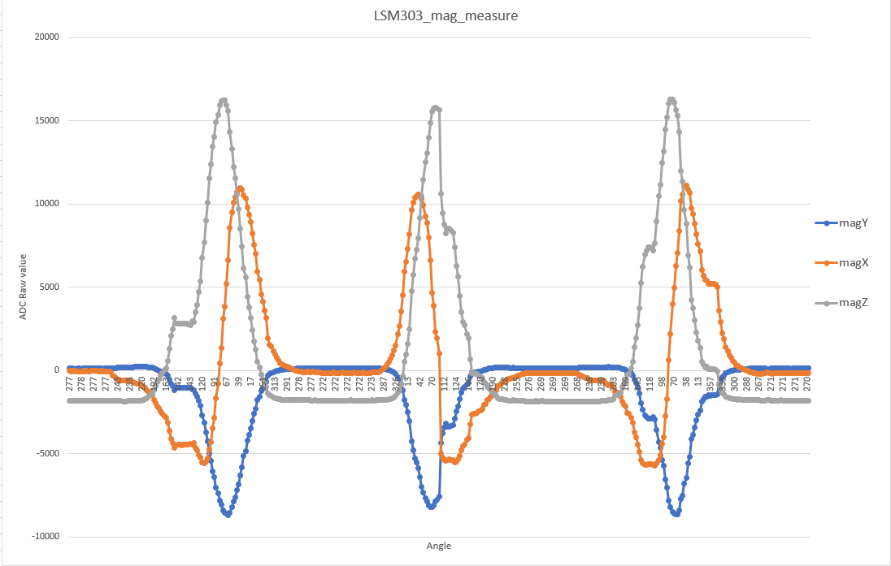

# Initilaization algorithm

## goals:
- Detect lock direction.
- Detect on which side of door lock is key inserted
  This is determined by magnetic vector polarization.
  the magnet will be at different orientation depending
  on which side of the door will be placed.

## Initializing phase:
- User should lock the door. SW will read max and min values for 
  x and z axis. Those two axis are used to detect rotation of the key
  y axis will be checked for 

## LSM303_mag response measure

## Patch for SDK V17.xx for nRF52805 chip
[nRF52805 patch for SDK 17.xx](https://devzone.nordicsemi.com/nordic/short-range-guides/b/getting-started/posts/developing-for-the-nrf52805-with-nrf5-sdk)  

[nRF52805 patch  .ZIP files for SDK 17.xx](https://devzone.nordicsemi.com/cfs-file/__key/communityserver-blogs-components-weblogfiles/00-00-00-00-13/SDK_5F00_v17.0.0_5F00_nRF52805_5F00_Patch.zip)  

## Add smke board definition to the SDK
Add changed board files (you find them in project_data folder ) in to:  
> \nRF5_SDK_17.0.2_d674dde\components\boards
